## 1.Accordion

```javaScript
const accordion = document.getElementsByClassName("accordion");
        
        let i;
        for(i = 0; i < accordion.length; i++){
            accordion[i].addEventListener("click", function(){
                this.classList.toggle("on");
                let card = this.nextElementSibling; //sibling element is = "p"//
                if(card.style.maxHeight){
                    card.style.maxHeight = null;
                }else{
                    card.style.maxHeight = card.scrollHeight + "px";
                }
            });

        }


```

## 2.Tab 

```javaScript

const content1 =document.getElementById("content1");
        const content2 =document.getElementById("content2");
        const content3 =document.getElementById("content3");

        const btn1 =document.getElementById("btn1");
        const btn2 =document.getElementById("btn2");
        const btn3 =document.getElementById("btn3");

        function openHtml(){
            content1.style.transform = "translateX(0)";
            content2.style.transform = "translateX(100%)";
            content3.style.transform = "translateX(100%)";
            btn1.style.color = "#fff";
            btn2.style.color = "#000";
            btn3.style.color = "#000";
            content1.style.transitionDelay = "0.3s"
            content2.style.transitionDelay = "0"
            content3.style.transitionDelay = "0"
        }
        function openCss(){
            content1.style.transform = "translateX(100%)";
            content2.style.transform = "translateX(0)";
            content3.style.transform = "translateX(100%)";
            btn1.style.color = "#000";
            btn2.style.color = "#FFF";
            btn3.style.color = "#000"; 
            content1.style.transitionDelay = "0"
            content2.style.transitionDelay = "0.3s"
            content3.style.transitionDelay = "0"
        }
        function openJs(){
            content1.style.transform = "translateX(100%)";
            content2.style.transform = "translateX(100%)";
            content3.style.transform = "translateX(0)";
            btn2.style.color = "#000";
            btn3.style.color = "#FFF";
            btn1.style.color = "#000";
            content1.style.transitionDelay = "0"
            content2.style.transitionDelay = "0"
            content3.style.transitionDelay = "0.3s"
        }
```

## 3. Tab Heading 

```javaScript

function showpanel(a,b,c){
    const tabpanel = document.getElementsByClassName("tabpanel");
    for(let i = 0; i< tabpanel.length; i++){
        tabpanel[i].style.display = "none";
    }

    const btn = document.getElementsByClassName("btn");
    for(let i = 0; i< btn.length; i++){
        btn[i].style.backgroundColor = "";
    }
    document.getElementById(a).style.display = "block";
    b.style.backgroundColor = c;
}
document.getElementById("default").click();

```

## 4. Menu Navigation Var

```javaScript


const menuBtn = document.querySelectorAll(".menu-btn");
const nav = document.getElementById("nav");
const open = document.querySelectorAll(".open");
const close = document.querySelectorAll(".close");

open[0].addEventListener("click", () =>{
    nav.style.left = "0";
    open[0].style.display = "none";
    close[0].style.display = "block"
})

close[0].addEventListener("click", () =>{
    nav.style.left = "-100%";
     open[0].style.display = "block";
    close[0].style.display = "none"

})
```

## 5. Search Filter

```javaScript

 function searchInput(){
            const input = document.getElementById("search");
            const ul = document.getElementById("myMenu");
            const li = ul.getElementsByTagName("li");

            const filter = input.value.toUpperCase();
            // console.log(input, ul, li);

            for(let i = 0; i< li.length; i++){
                const a = li[i].getElementsByTagName("a")[0];
                if(a.innerHTML.toUpperCase().indexOf(filter) > -1){
                    li[i].style.display = "";
                }else{
                    li[i].style.display = "none";
                }

            }

        }
```


## 6. Side nav overlay

### open/close 

```javaScript

        function closeNav(){
            document.getElementById("mySidenav").style.width = "0";
        }
        function openNav(){
            document.getElementById("mySidenav").style.width = "350px";
        }
```

### overlay sidenav/ off-canvas menu

```javaScript

// if change background color
        function closeNav(){
            document.getElementById("mySidenav").style.width = "0";
            document.getElementById("main").style.marginLeft = "0"; 
            //  document.getElementById("main").style.backgroundColor = "bisque";
        }
        function openNav(){
            document.getElementById("mySidenav").style.width = "350px";
            document.getElementById("main").style.marginLeft = "350px"; 
            //  document.getElementById("main").style.backgroundColor = "rgba(0,0,0,0.05)";
        }

```

## 7. Hide top navbar scroll


```javaScript
        window.onscroll = function(){
            scrollbarNavigation();
        }
        function scrollbarNavigation(){
            const navbar = document.getElementById("navbar");

            if(document.body.scrollTop > 50 || document.documentElement.scrollTop >50){
                navbar.style.top = "0";
            }else{
                navbar.style.top = "-70px";
            }
        };

        // to create shrink use this elements 
           /* if(document.body.scrollTop > 50 || document.documentElement.scrollTop >50){
                navbar.style.padding = "30px 10px";
            }else{
                navbar.style.padding = "60px 20px";
            }*/

```
## 8. image slider

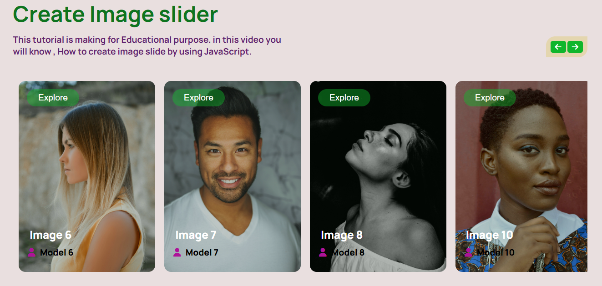


```javaScript

// == referance ==

const prevBtn = document.getElementById("prev");
const nextBtn = document.getElementById("next");
const slider = document.getElementById("slider");

// == next btn == 
nextBtn.addEventListener("click", nextPage);
function nextPage(){
    slider.appendChild(slider.firstElementChild);
};

// == privious btn == 
prevBtn.addEventListener("click", previousPage);
function previousPage(){
    slider.prepend(slider.lastElementChild);
};


// == auto slider== 
function autoSlide(){
    autoInterval = setInterval(timer, 2000);
    function timer(){
        nextPage();
    }
    //  setInterval(() => nextPage(), 3000);
} 
autoSlide();
// ==resume suto slider== 
slider.addEventListener("mouseout", autoSlide);
nextBtn.addEventListener("mouseout", autoSlide);
prevBtn.addEventListener("mouseout", autoSlide);


// == stop auto slider== 
slider.addEventListener("mouseover", deleteAutoSlider);
nextBtn.addEventListener("mouseover", deleteAutoSlider);
prevBtn.addEventListener("mouseover", deleteAutoSlider);

function deleteAutoSlider(){
    clearInterval(autoInterval);
};

```

## 9. slideshow dot image

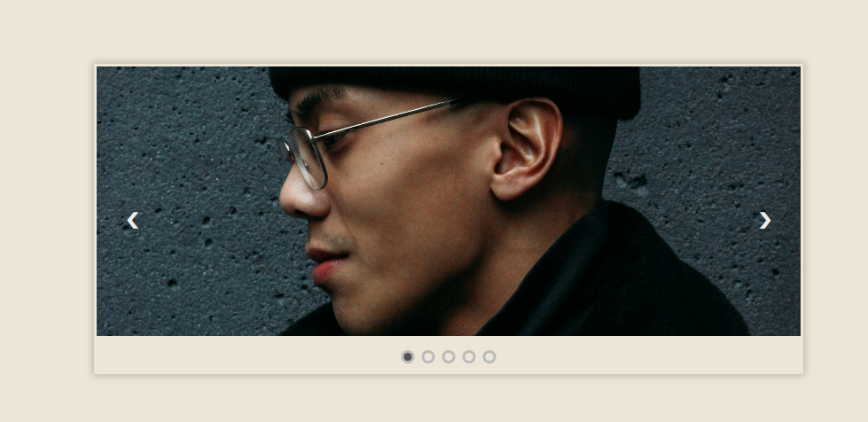


```javaScript

// Access the Images
	let slideImages = document.querySelectorAll('img');
	// Access the next and prev buttons
	let next = document.querySelector('.next');
	let prev = document.querySelector('.prev');
	// Access the indicators
	let dots = document.querySelectorAll('.dot');

	var counter = 0;

	// Code for next button
	next.addEventListener('click', slideNext);
	function slideNext(){
	slideImages[counter].style.animation = 'next1 0.5s ease-in forwards';
	if(counter >= slideImages.length-1){
		counter = 0;
	}
	else{
		counter++;
	}
	slideImages[counter].style.animation = 'next2 0.5s ease-in forwards';
	indicators();
	}

	// Code for prev button
	prev.addEventListener('click', slidePrev);
	function slidePrev(){
	slideImages[counter].style.animation = 'prev1 0.5s ease-in forwards';
	if(counter == 0){
		counter = slideImages.length-1;
	}
	else{
		counter--;
	}
	slideImages[counter].style.animation = 'prev2 0.5s ease-in forwards';
	indicators();
	}

	// Auto slideing
	function autoSliding(){
		deletInterval = setInterval(timer, 3000);
		function timer(){
			slideNext();
			indicators();
		}
	}
	autoSliding();

	// Stop auto sliding when mouse is over
	const container = document.querySelector('.slide-container');
	container.addEventListener('mouseover', function(){
		clearInterval(deletInterval);
	});

	// Resume sliding when mouse is out
	container.addEventListener('mouseout', autoSliding);

	// Add and remove active class from the indicators
	function indicators(){
		for(i = 0; i < dots.length; i++){
			dots[i].className = dots[i].className.replace(' active', '');
		}
		dots[counter].className += ' active';
	}

	// Add click event to the indicator
	function switchImage(currentImage){
		currentImage.classList.add('active');
		var imageId = currentImage.getAttribute('attr');
		if(imageId > counter){
		slideImages[counter].style.animation = 'next1 0.5s ease-in forwards';
		counter = imageId;
		slideImages[counter].style.animation = 'next2 0.5s ease-in forwards';
		}
		else if(imageId == counter){
			return;
		}
		else{
		slideImages[counter].style.animation = 'prev1 0.5s ease-in forwards';
		counter = imageId;
		slideImages[counter].style.animation = 'prev2 0.5s ease-in forwards';	
		}
		indicators();
	}

```


## 10. image slider

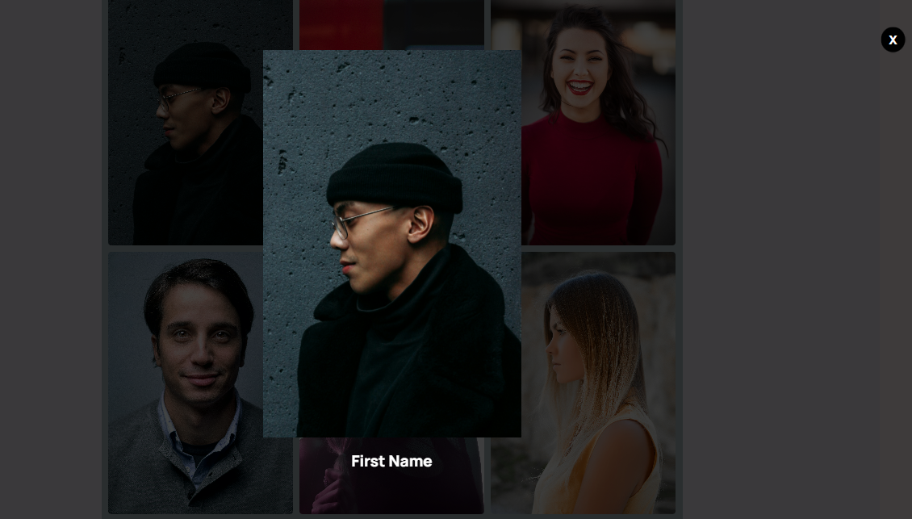


```javaScript

//set variable

const mainImages = document.querySelectorAll(".images img");
const modalBody = document.querySelector(".modal");
const modalImages = document.querySelector(".modal-img");
const text = document.querySelector(".modal-text");
const close = document.querySelector(".closed");

//take ForEach loop in images to appear a classlist on their

mainImages.forEach((image) =>{
    image.addEventListener('click', () =>{
        modalBody.classList.add("active");
          
        // //indevidual Title and individual photo
        modalImages.src = image.src;
        text.innerHTML = image.alt; 
        

        close.addEventListener('click', () =>{
            modalBody.classList.remove("active");
        });
    });

});


```

## 11. photo filter

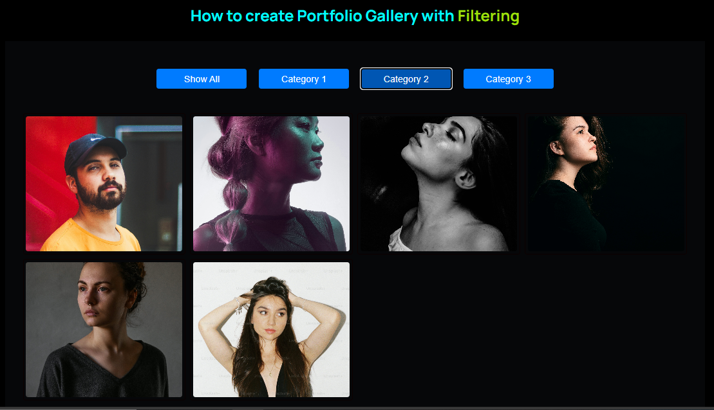


```javaScript

const btnContainer = document.getElementById("myBtnContainer");
const buttons = document.querySelectorAll(".btn");
const columns = document.querySelectorAll(".column");

const mainImage = document.querySelectorAll(".grid img");
const modal = document.querySelector(".modal");
const modalImage = document.querySelector(".modal-img");
const closed = document.querySelector(".closed"); 
const text = document.querySelector(".modal-text"); 


//generate function

  function filterSelection(category) {
  // Show all if category is 'all', otherwise filter by category
  columns.forEach((a) => {
    if (category === "all" || a.classList.contains(category)) {
      a.classList.add("show");
      
    } else {
      a.classList.remove("show");
      
    }
  });
}
// Initialize to show all
filterSelection("all");

                                                                       
// Add active class to the clicked button

buttons.forEach((btn) => {
  btn.addEventListener("click", function () {
    // Remove 'active' class from all buttons
    buttons.forEach((i) => i.classList.remove("active"));
    // Add 'active' class to the clicked button
    btn.classList.add("active");
    
  });
});


```

## 12.Scroll top toggle


```javaScript
 const topScroll = document.querySelector('.top-scroll');

        window.addEventListener('scroll', () => {
            if(window.pageYOffset > 100){
                topScroll.classList.add("active")
            }else{
                topScroll.classList.remove("active")
            }
        });

          /*
          const topScroll = document.querySelector('.top-scroll');
          window.addEventListener('scroll', () => {
            window.pageYOffset > 100 ? topScroll.classList.add("active") : topScroll.classList.remove('active')
         })*/


```

## 13.modal form

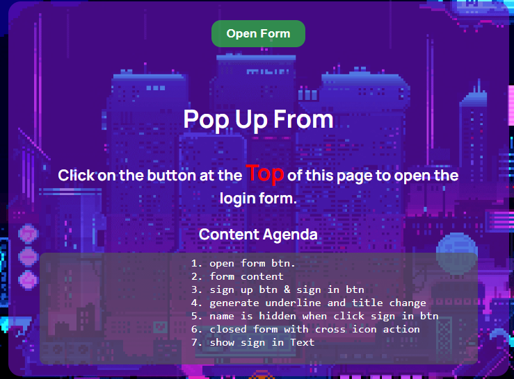

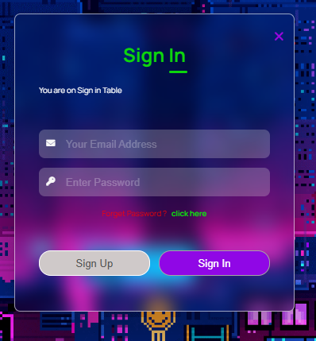


```javaScript
// submit button
const signUpBtn = document.querySelector('.submit-btn'); 
//sign in button
const signInBtn = document.querySelector('.signIn-btn ');
//from box 
const nameField = document.querySelector('.namefield '); 

//others variable
const title = document.querySelector('.title '); //title text
const underline = document.querySelector('.underline '); // underline div
const passText = document.querySelector('.pass-text ');// form peragraph text

//generate open btn function 
let content = document.querySelector('.content');
let openBtn = document.querySelector('.open-button');

function openForm() {
    document.getElementById("modal").style.display = "block";
    content.style.display = "none"; //content
    openBtn.style.display = "none"; //open btn 

};
// generate cross btn function in form box
function closeForm() {
    document.getElementById("modal").style.display = "none";
    content.style.display = "block";//content
    openBtn.style.display = "block"; //open btn

}

// generate sign In button function

signInBtn.addEventListener('click', () =>{
    nameField.style.maxHeight = "0";
    title.innerHTML = "Sign In";
    underline.style.transform = "translateX(40px)";
    signUpBtn.classList.add('disable');
    signInBtn.classList.remove('disable');
    passText.innerHTML = "Forget Password ?   ";
    passText.style.color = "red";

    //checked text
    const checked = document.querySelector('#checked');
    checked.style.display = "block";
  
});
// generate sign up button function
signUpBtn.addEventListener('click', () =>{
    nameField.style.maxHeight = " 80px";
    title.innerHTML = "Sign Up";
    signUpBtn.classList.remove('disable');
    signInBtn.classList.add('disable');
    underline.style.transform = "translateX(0)";
    passText.innerHTML = "Password Suggestion";
    passText.style.color = " #fdfdfd";

    //checked text

    const checked = document.querySelector('#checked');
    checked.style.display = "none";

});


```


## 14.Registration form step

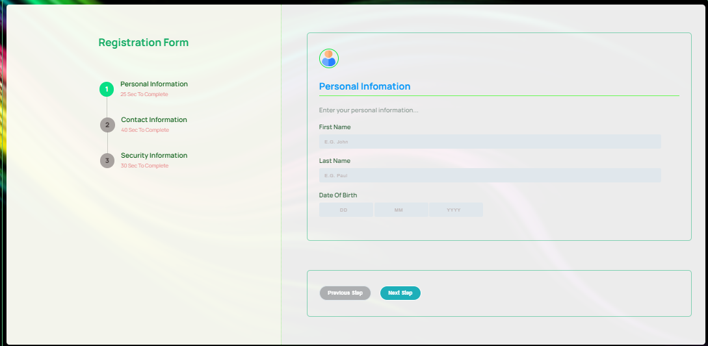
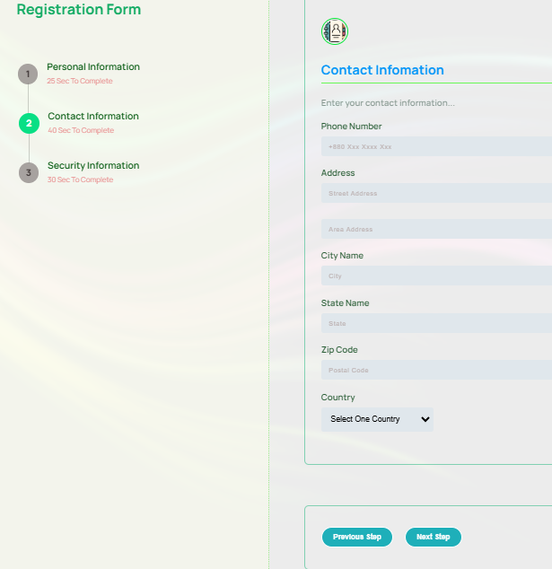
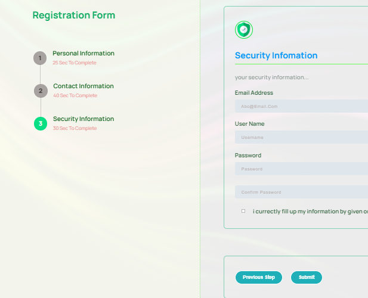


```javaScript
const nextBtn = document.querySelector(".btn-nxt");
const prevBtn = document.querySelector(".btn-prv");
const submitBtn = document.querySelector(".btn-submit");

const progressStep = document.querySelectorAll(".step");
const formStep = document.querySelectorAll(".from-step");


let active = 1 ;
length = progressStep.length;

//next btn
nextBtn.addEventListener('click', () => {
    active++;
    if(active > length){
        active = length;
    }
    updateProgressStep();
});

//previous btn
prevBtn.addEventListener('click', () => {
    active--;
    if(active < 1){
        active = 1;
    }
    updateProgressStep();
});


const updateProgressStep = () => {
    //toggle active class by using loop
    progressStep.forEach((event, i) => {
        
        if (i ==(active-1)){
            event.classList.add('active');
            formStep[i].classList.add('active');
           
        } else{
            event.classList.remove('active');
            formStep[i].classList.remove('active')
        }
    });


    //button enable or disable
    if (active === 1){
        prevBtn.disabled = true;
    }else if (active === length){
        nextBtn.disabled = true;
    }else{
        prevBtn.disabled = false;
        nextBtn.disabled = false;
    }
}

```

## 15.Search products filter

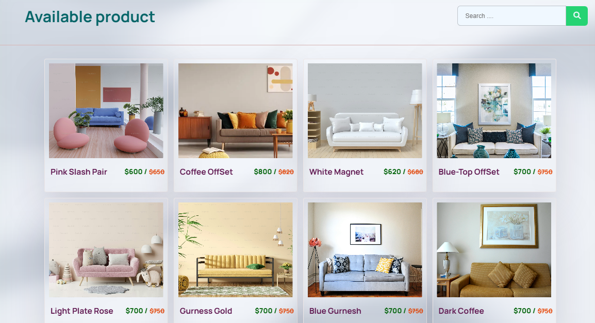
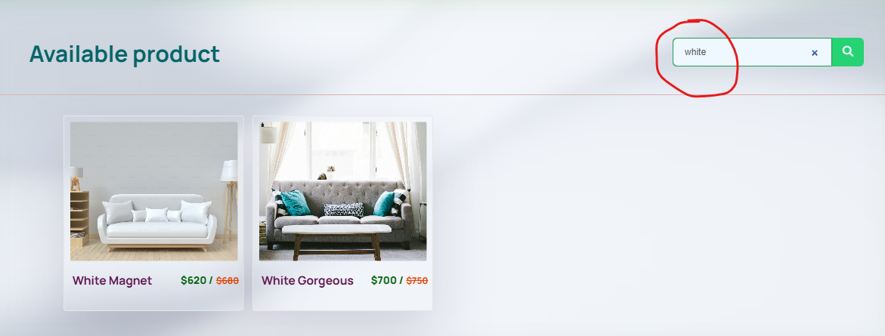

```javaScript

function searchOn() {
    const input = document.getElementById('find').value.toUpperCase();; 
    // const filter = input.value.toUpperCase(); 
    const products = document.getElementById('products'); 
    const productCards = products.querySelectorAll('.product-card'); 
    
    // Loop through each product card
    productCards.forEach((a) => {
        const h3 = a.querySelector('.heading'); 
        const txtValue = h3.textContent || h3.innerText; 
            if (txtValue.toUpperCase().indexOf(input) > -1) {
                a.style.display = '';
            } else {
                a.style.display = 'none';
            }
        }
    );
};

```

## 16.Range

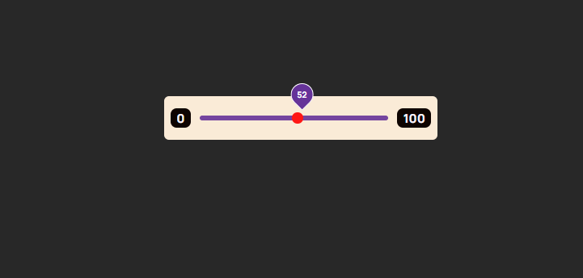


```javaScript

 const sliderPoint = document.querySelector('span');
        const range = document.querySelector('input');

        range.oninput = ( () => {
            let value = range.value;
            sliderPoint.textContent = value;

            //for scroll
            sliderPoint.style.left = (value/2) + "%"
            //scroll show
            sliderPoint.classList.add('show');
        })
        //scroll hide
       range.onblur = ( () => {
           
            sliderPoint.classList.remove('show');
        });

```

## 17.email

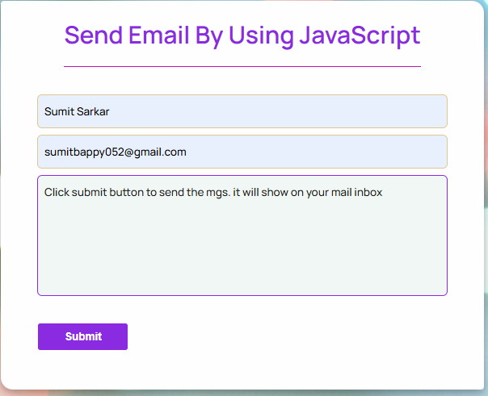


```html

 <form action="https://api.web3forms.com/submit" method="POST">
            <input type="hidden" name="access_key" value="7babca68-faee-4353-abb0-596ef90e2ffd">
            
            <input type="hidden" name="redirect" value="https://web3forms.com/success">
           

        </form>
```


  
